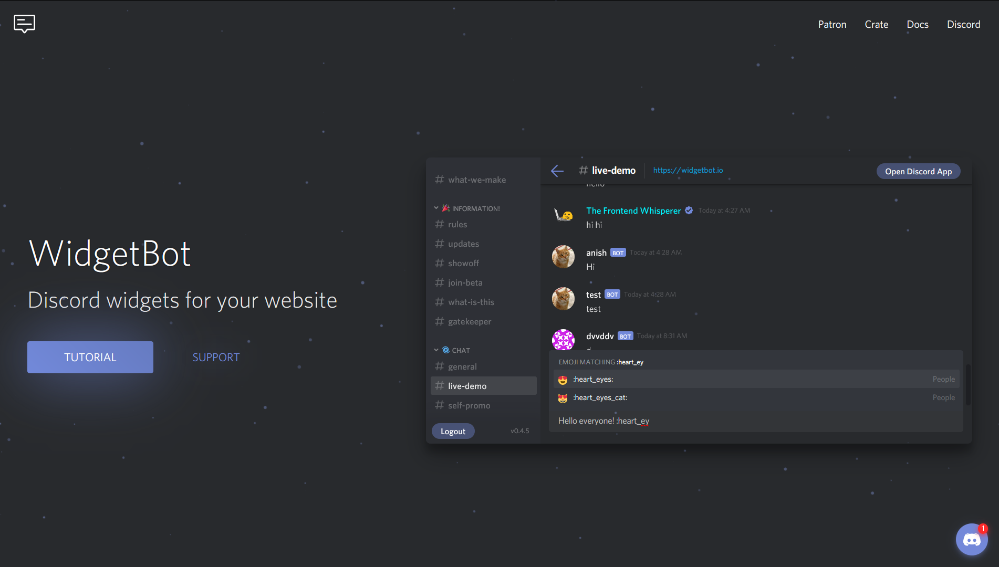

# [WidgetBot](https://widgetbot.io)  [](https://www.jsdelivr.com/package/npm/@widgetbot/crate) [](https://www.jsdelivr.com/package/npm/@widgetbot/html-embed)

> WidgetBot is a pixel-perfect open-source Discord chat widget for your website. It is distributed and developed under the [GNU General Public License v3 (GPL-3) Open Source License](<https://tldrlegal.com/license/gnu-general-public-license-v3-(gpl-3)>).

[](https://widgetbot.io)

| @widgetbot/                                                    | Description                         |                                                      |                                                  |
| -------------------------------------------------------------- | ----------------------------------- | ---------------------------------------------------- | ------------------------------------------------ |
| [embed](https://widgetbot.io)                                  | ReactJS widget client               | [Docs](https://docs.widgetbot.io/embed/)             | [/packages/embed/](/packages/embed/)             |
| [crate](http://npmjs.com/package/@widgetbot/crate)             | JS library that provides popup chat | [Docs](https://docs.widgetbot.io/embed/crate/)       | [/packages/crate/](/packages/crate/)             |
| [react-embed](http://npmjs.com/package/@widgetbot/react-embed) | React component for the embed       | [Docs](https://docs.widgetbot.io/embed/react-embed/) | [/packages/react-embed/](/packages/react-embed/) |
| [html-embed](http://npmjs.com/package/@widgetbot/html-embed)   | HTML element for the embed          | [Docs](https://docs.widgetbot.io/embed/html-embed/)  | [/packages/html-embed/](/packages/html-embed/)   |
| [embed-api](http://npmjs.com/package/@widgetbot/embed-api)     | Embed GraphQL JS API                | [Docs](https://docs.widgetbot.io/embed/embed-api/)   | [/packages/embed-api/](/packages/embed-api/)     |

## Getting started

**Requirements:**

- Node.js 10+
- Yarn

### Building sources

```bash
git clone https://github.com/widgetbot-io/widgetbot.git
cd widgetbot

# Install dependencies
yarn

# Build the server
yarn workspace server build
yarn workspace embed build

# WidgetBot has now been built at src/server/dist
# simply edit & copy over data/config.template.yml to data/config.yml
# and run `npm install; npm run start` to get it up
```

## Development

This project is structured in a monorepo format, using [lerna](https://lernajs.io).

## Embed

The embed is mostly React.JS with Typescript.

- [React.js](https://reactjs.org) for describing the UI
- [apollo-client](npmjs.com/package/apollo-client) and GraphQL for data fetching
- [Mobx](https://mobx.js.org/) and [mobx-state-tree](https://github.com/mobxjs/mobx-state-tree) for state management
- [Emotion](https://emotion.sh) for styling components

```bash
yarn workspace embed start
# Embed is now available over at http://localhost:3000/channels/299881420891881473
```

## Server

The server uses Node.JS with Typescript.

The server is responsible for providing a [GraphQL API](https://graphql.com) to interact with the Discord API.

```bash
yarn workspace server start
# Access the GraphQL API at http://localhost:7000/api/graphql
# Server will automatically restart on changes
```

**Database**

[Prisma](https://www.prisma.io) provides a GraphQL API to query data from the database, and an auto-generated type-safe client.

**Services**

The server uses services and dependency injection, with [type-di](https://www.npmjs.com/package/typedi). Services can be found in `/src/server/src/services`

**GraphQL**

The GraphQL server uses [type-graphql](https://github.com/19majkel94/type-graphql) to describe the GraphQL API and resolve it. The models can be found in `/src/server/src/entities`, and the resolvers in `/src/server/src/resolvers`

### Folder structure

```bash
 - packages # This folder contains modules that are used internally, and also
               # published to NPM.

 - src      # This folder contains sources for stuff that it doesn't make sense
            # to publish on NPM. eg. the server & embed
```

---

## Contributors

Thanks goes to these wonderful people ([emoji key](https://github.com/kentcdodds/all-contributors#emoji-key)):

<!-- ALL-CONTRIBUTORS-LIST:START - Do not remove or modify this section -->
<!-- prettier-ignore -->
| [<br /><sub><b>Sam Denty</b></sub>](https://samdd.me)<br />[🐛](https://github.com/widgetbot-io/widgetbot/widgetbot-io/WidgetBot/issues?q=author%3Asamdenty99 "Bug reports") [💻](https://github.com/widgetbot-io/widgetbot/widgetbot-io/WidgetBot/commits?author=samdenty99 "Code") [🎨](#design-samdenty99 "Design") [📖](https://github.com/widgetbot-io/widgetbot/widgetbot-io/WidgetBot/commits?author=samdenty99 "Documentation") [💡](#example-samdenty99 "Examples") [🚇](#infra-samdenty99 "Infrastructure (Hosting, Build-Tools, etc)") [👀](#review-samdenty99 "Reviewed Pull Requests") [🔧](#tool-samdenty99 "Tools") |
| :---: |

<!-- ALL-CONTRIBUTORS-LIST:END -->

This project follows the [all-contributors](https://github.com/kentcdodds/all-contributors) specification. Contributions of any kind welcome!
